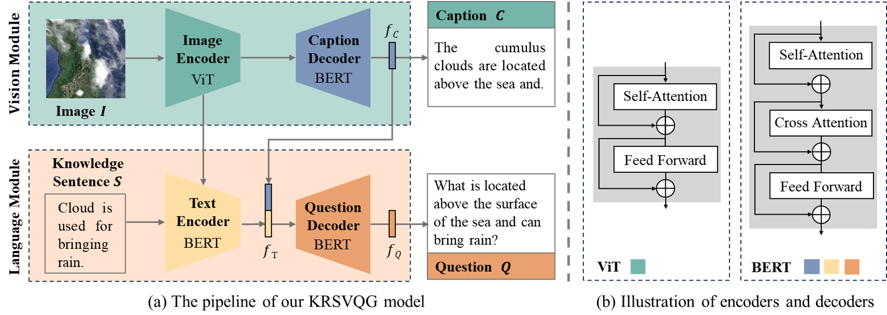

# KRSVQG

This is the official PyTorch implementation for the paper:

> Knowledge-aware Visual Question Generation for Remote Sensing Images.

The code has been tested on PyTorch 1.11. To install the dependencies, run

```bash
pip install -r requirements.txt
```

## Overview

To enhance the comprehension of visual content and improve image analysis, we propose a knowledge-aware visual question generation model for remote sensing images, termed **KRSVQG**. The overall architecture of the model consists of 4 parts: an image encoder, a caption decoder, a text encoder, and a question decoder. For the vision module, given an input image $I$, the image encoder encodes the input image and the caption decoder produces a caption $C$. As for the language module, the knowledge sentence $S$ is encoded by the text encoder, and then the embedding from the caption decoder ($f_{C}$) and those from the text encoder ($f_{T}$) are combined as the input for the question generation. Finally, the question decoder generates questions with the fused information. Besides the multimodal structure, we also introduce a specialized training strategy to train the proposed model on limited annotations, involving separate pre-training for vision and language modules followed by fine-tuning on the target remote sensing VQG datasets.




## Download Datasets

We provide the dataset annotations in `/data'. For the image source, please download the NWPU-Caption images data from the [link](https://figshare.com/articles/dataset/NWPU-RESISC45_Dataset_with_12_classes/16674166) and download the TextRS-Caption image data from the [link](https://github.com/yakoubbazi/TextRS).

## Model Training

### Vision Pre-training (VPT):

```bash
cd src
python train_caption_nwpu.py
```

### Language Pre-training (LPT):

```bash
python train_vqg_kvqg.py
```

### Fine-tuning on Remote Sensing (FT):

```bash
python train_vqg_RSFT.py
    --config ./configs/vqg_kvqg_nwpu.yaml \    # ./configs/vqg_kvqg_textrs.yaml for textrs-300
    --output_dir output/NWPU-300/Model3 \      # .output/TextRS-300/Model3 for textrs-300

python train_vqg_RSFT_2.py
    --config ./configs/vqg_kvqg_nwpu_2.yaml \  # ./configs/vqg_kvqg_textrs_2.yaml for textrs-300
    --output_dir output/NWPU-300/Model4 \      # .output/TextRS-300/Model4 for textrs-300
```

## Citation
If you find this code to be useful for your research, please consider citing.

```bash

```

## Acknowledgement

The implementation of KRSVQG relies on resources from [BLIP](https://github.com/salesforce/BLIP/tree/main) and [Huggingface Transformers](https://github.com/huggingface/transformers). We thank the original authors for their open-sourcing.